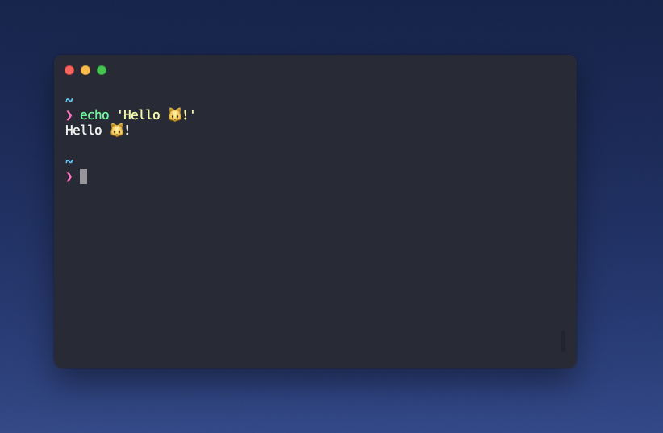

# Dotfiles



This repository contains my personal dotfiles, including configurations for zsh, Hyper terminal, and various tools. Feel free to explore, fork, and use them to customize your own development environment.

## Prerequisites

Before you begin, ensure you have the following dependencies installed:

- [Hyper Terminal](https://hyper.is/)
- [Homebrew](https://brew.sh/)
- [Zsh](https://www.zsh.org/)
- [Antidote](https://github.com/mattmc3/antidote)
- Node.js (preferable via [nvm](https://github.com/nvm-sh/nvm))
- [Nerd Fonts](https://github.com/ryanoasis/nerd-fonts)

## Installation

1. **Clone the repository:**

    ```bash
    git clone https://github.com/nkavtur/dotfiles.git ~/.dotfiles
    cd ~/.dotfiles
    ```

2. **Run the installation script:**

    ```bash
   ~/.dotfiles/install.sh
    ```

   This script will symlink the dotfiles to your home directory, creating backups if necessary.

3. **Restart your terminal or reload your shell.**

    ```bash
    source ~/.zshrc
    ```
